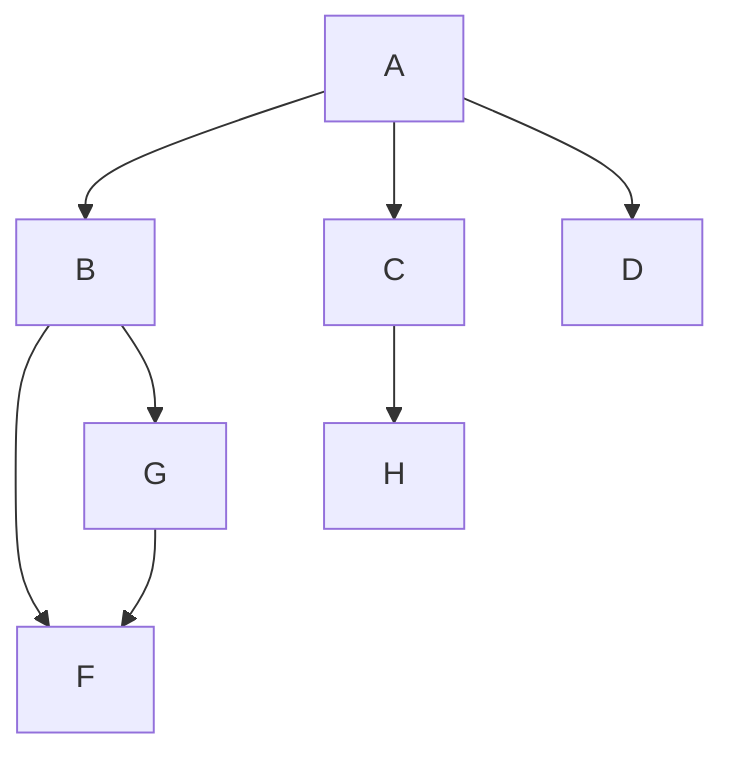

# 这个标题拥有 1 个 id {#my_id}

# 这个标题有 2 个 classes {.class1 .class2

https://github.com

```javascript {.line-numbers}
function add(x, y) {
    return x + y
}
```


```mermaid
graph TD;
    A-->B;
    A-->C;
    A-->D;
    B-->F;
    B-->G;
    G-->F
    C-->H;
```
